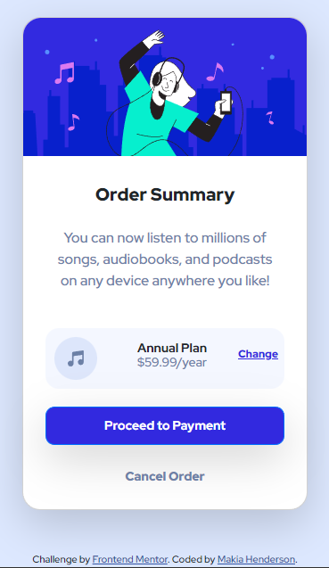

# Frontend Mentor - Order summary card solution

This is a solution to the [Order summary card challenge on Frontend Mentor](https://www.frontendmentor.io/challenges/order-summary-component-QlPmajDUj). Frontend Mentor challenges help you improve your coding skills by building realistic projects. 

## Table of contents

- [Overview](#overview)
  - [Screenshot](#screenshot)
  - [Links](#links)
- [My process](#my-process)
  - [Built with](#built-with)
  - [What I learned](#what-i-learned)
  - [Continued development](#continued-development)
  - [Useful resources](#useful-resources)
- [Author](#author)

## Overview

### Screenshot

### Links

- Solution URL: [https://github.com/Makia98/OrderSummaryCard](https://github.com/Makia98/OrderSummaryCard)
- Live Site URL: [https://makia98.github.io/OrderSummaryCard/](https://makia98.github.io/OrderSummaryCard/)

## My process

### Built with

- Semantic HTML5 markup
- CSS custom properties
- Flexbox
- Mobile-first workflow
- [Bootstrap](https://getbootstrap.com/) - CSS Framework

### What I learned

I was able to play around with flex and the css box model. 

### Continued development

I'd love to dive even further into how to customize Bootstrap as well as practicing the CSS Box Model for styling.

### Useful resources

- [Boostrap](https://getbootstrap.com/docs/5.2/components/card/) - This was the foundation of my project and made building the card component very easy. The documentation is a wonderful resource on how to build the card.
- [MDN](https://developer.mozilla.org/en-US/docs/Web/CSS/padding) - MDN is of course my go to resource for all things HTML and CSS. Specifically I used this resource when trying to remember the padding syntax.
[Outfit](https://fonts.google.com/specimen/Outfit) - Google Fonts was used and will be for many projects if not all.

## Author
- Frontend Mentor - [@Makia98](https://www.frontendmentor.io/profile/Makia98)

